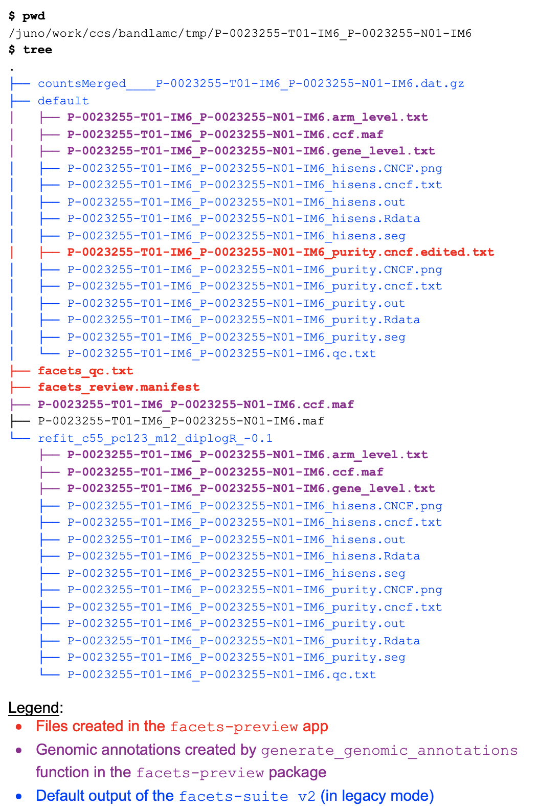

# Input requirements

## 0. Loading a sample

At minimum only the facets run path is required to load a sample. For example, inputting the path: `/juno/work/ccs/facets_runs/tumorID_normalID/`, lets preview infer the `sample_id` as tumorID\_normalID

## 1. Manifest file

The manifest file is required to have at least three columns with an additional column that is optional:

* `sample_id` column. eg: tumorID\_normalID 
* `sample_path` column. eg: /juno/work/ccs/facets\_runs/tumorID\_normalID/
* `tumor_sample` column. eg: tumorID
* `dmp_id` column \(optional\): eg: P-0000000 if the  tumorID is from DMP patient P-0000000. This is only ever used to build the cBioPortal link.

## 2. Facets output structure

`facets-preview` takes only the `sample_id` and `sample_path` as input. Therefore, it relies on the specific directory structure to infer the number of files, the type of runs, etc. The default output generated by `facets-suite-2.0` or higher \(**in `--legacy-output` mode only**\) is fully compatible with `facets-preview`. The following is the sample output structure \(**NOTE**: the files that are not in blue are not required to load `facets-preview`\):

### Example command:

```text
/juno/work/ccs/bandlamc/software/R_libs/facetsSuite/2.0.1-beta/run-facets-wrapper.R 
	--facets-lib-path /juno/work/ccs/bandlamc/software/R_libs/facets/0.5.14/ 
	--counts-file /juno/work/ccs/bandlamc/tmp/P-0007584-T01-IM5_P-0007584-N01-IM5/countsMerged____P-0007584-T01-IM5_P-0007584-N01-IM5.dat.gz
	--sample-id P-0007584-T01-IM5_P-0007584-N01-IM5
	--directory /juno/work/ccs/bandlamc/tmp/P-0007584-T01-IM5_P-0007584-N01-IM5/default/
	--snp-window-size 250 
	--normal-depth 35 
	--min-nhet 15 
	--purity-min-nhet 15 
	--seed 100
	--cval 50 
	--purity-cval 100 
	--legacy-output T 
	--genome hg19 
```

### Example directory structure:



### Notes:

1. `facets_review.manifest` contains the review information associated with the sample. The 13 columns in this file include: review\_status, review\_status, reviewed\_by, etc. The `facets_qc_version` used to generate the final `facets_qc` call is also stored here. This allows storing `facets_qc` status for multiple versions of facets qc. When a sample is loaded for the first time in `facets-preview`, this file is automatically created.
2. `facets_qc.txt` has the more detailed qc metrics for each of the fits. These include statuses for the different facets qc filters along with the notes. When a sample is loaded for the first time in `facets-preview`, this file is automatically created.
3. \*cncf.edited.txt is generated by facets-preview. See the section on Reviewing fits.
4. The `*ccf.maf`, `*gene_level.txt` and `*arm_level.txt` are generated for every fit by running the function `facetsPreview::generate_genomic_annotations.` Note: To generate CCF calls, the maf file \(eg: P-0023255-T01-IM6\_P-0023255-N01-IM6.maf\) should exist in top level directory. 

## 3. ...


